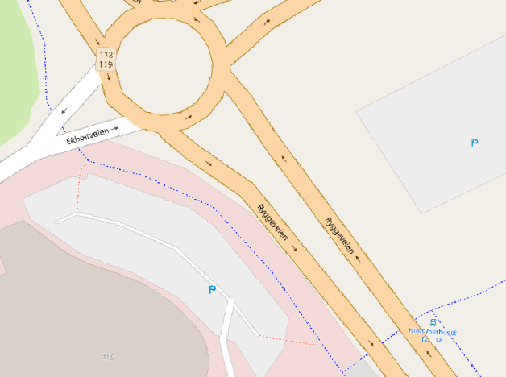
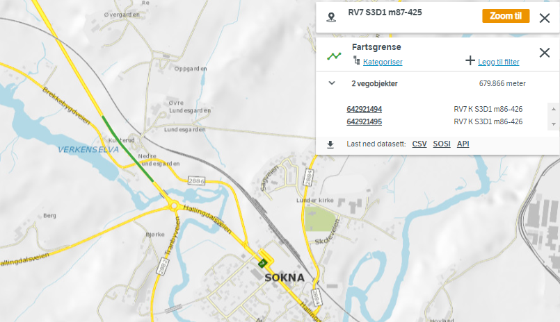

# Grabbing data from NVDB api 

The [NVDB api](https://nvdbapiles-v3.atlas.vegvesen.no/dokumentasjon/) is a REST api where you can grab any data from NVDB, including speed limits, road networks and a bunch of other things. Unfortunately, the documentation is in Norwegian. We've written some English summaries [here](https://www.vegdata.no/2014/02/19/a-little-note-to-oor-our-international-fans/) and [here](https://nvdbtransportportal.vegdata.no/), we hope you'll find them helpful. 

Grabbing data from NVDB api involves the following: 
  * We really, really appreciate that you set the appropriate identification headers, so we can reach out if there's any problems (and we may throttle you if you don't)
  * Implement [pagination](https://nvdbtransportportal.vegdata.no/README.html#pagination). 
  * Transforming the generic NVDB data structure into whatever suits your purpose. 
    * For most GIS applications, the NVDB nested data structure with loads of "list-of-dictionaries-within-lists"  must be flattened into a simple, flat (key=value) data structure. 
  * Transforming the coordinates from UTM zone 33 (epsg:5973 or epsg:25833, which for most practical purposes are equivalent) into your preferred coordinate system. 
    * The NVDB api will happyily provide lat, lon coordinates in the epsg:4326 system if you specify `srid=4326` in your API query. 
    * Please be warned that a lot of GIS and mapping software follows the convension that axis order is X,Y (i.e. lon,lat), which is the oposite of the [epsg:4326 definition](https://epsg.io/4326). 
  

Please see this  [python example](./grab-from-nvdbapi-w-python.md) for inspiration. We also have working code examples for [FME](https://safe.com) (Feature manipulation engine), [QGIS](https://www.qgis.org/en/site/), [Google colab](https://colab.research.google.com/), as well as expertise on some others. There's also an ESRI option for grabbing data from NVDB into a file geodatabase, but please talk to our [Esri vendor, Geodata A/S](https://geodata.no/) about that. 

### Some quirks with data from NVDB api 

Speed limits needs to be mapped from the main center line representation to the individual lanes or separated roadway representation - if present. Such as [the speed limit on this road here](https://vegkart.atlas.vegvesen.no/#kartlag:nib/@255410,6593957,17/hva:!(id~105)~) 

Which is your plain, old trusty center line representation of the road network. However, if your road network is represented as separate roadways (or separate lanes), such as this [Open Street Map example](https://www.openstreetmap.org/#map=19/59.41286/10.68927) 

Then the NVDB speed limit data, which follows the center line representation, must be mapped into your individual lane (or one-way roadway) representation. I.e. data on the green line below must be mapped into the OSM road network parallell to the green line. 

If this is straightforward and doable for your data ingestion routine I strongly suggest you read data from the NVDB api. 

However, trouble arises for the approximately 7000 NVDB speed limits objects (about 874 km) where we have different speed limits for oposite directions. These objects will be laid on top of each other on the center line. Mapping the corrrect objekt to the correct lane number is doable, but not straightforward. 

As an example, these two NVDB speed limit objects 

| Nndb Id | Speed limit | Lane code | Direction  | 
|---|---|---|---|
| [642921494](https://nvdbapiles-v3.atlas.vegvesen.no/vegobjekter/105/642921494/3.json) | 80 km/h | 1 | Nortward bound   |
| [642921495](https://nvdbapiles-v3.atlas.vegvesen.no/vegobjekter/105/642921495/1.json)  | 60 km/h  | 2  | Southward bound  |

speed limit 80 and  speed limit 60 have identical geometry, marked with green in the map below. [View the map online in our web application "vegkart"](https://vegkart.atlas.vegvesen.no/#kartlag:geodata/@218789,6689511,13/hva:!(id~105)~/hvor:(vegsystemreferanse~!RV7S3D1M87-425)~)

> We will strive to make a more robust and simplified mapping between center line and individual lanes, as this is one of the remaining pain points for NVDB api users. 