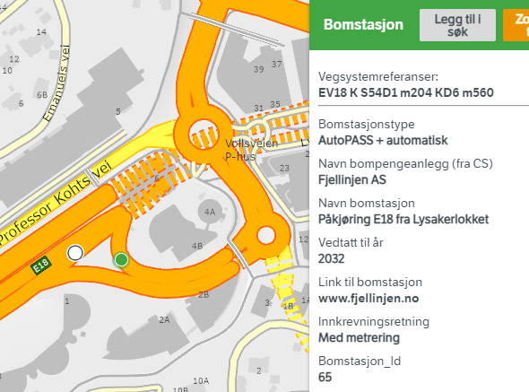
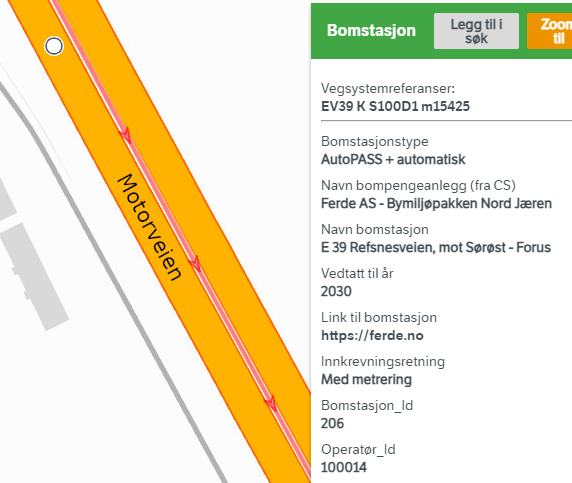
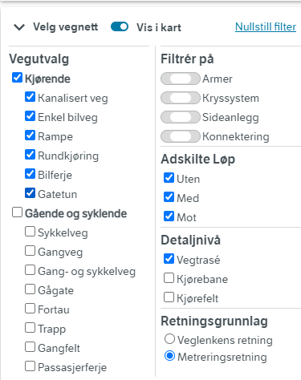
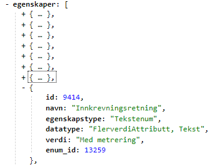
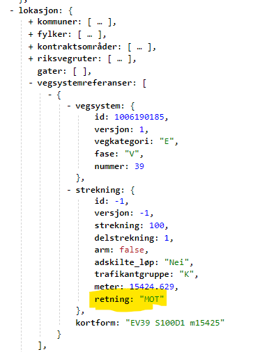
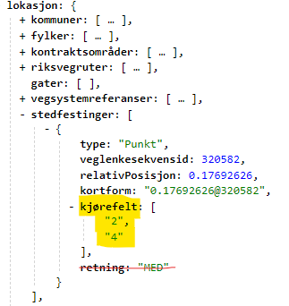

# Tollstations in NVDB versus Autopass master deta

Tollstations in NVDB is the feature type [45 Bomstasjon](https://datakatalogen.atlas.vegvesen.no/#/45/Bomstasjon). It is imperative to remember that NVDB is not the original data source for toll stations: The master data are deep inside the [autopass](https://www.autopass.no/en/). The data syncronization between autopass and NVDB is under improvement. We also hope that the autopass data can be distributed as open data in a not too distant future. 

### Data model discrepancies

NVDB  has a very limited set of properties compared to the original autopass data. 
  * **Vehicle types**: Autopass differentiates between at least 10 different vehicle types. NVDB only has two: Small (liten bil, < 3.5 tonn) and large (stor bil, > 3.5 tonn). 
    * Examples of autopass small (<3.5 tonn) vehicle types: electric, hybrid, petrol, diesel. 
    * Examples of autopass large (> 3.5 tonn) vehicle types: Euro5 diesel, Euro6 diesel, LargeElectric, LargeHybrid, LargePetrol. 
  * **Price differentiation per vehicle type** NVDB has a relatively fixed price differentiation for the two NVDB vehicle types (_Takst liten bil, Takst stor bil_). Autopass has flexibility for pricing each vehicle type individually. 
  * **Price differentiation by rush hour** Presently, the NVDB and autopass data model for rush hour are comparable. However, we expect that new, interesting and creative ways to model time variable toll will emerge. The autopass data model has considerable flexibility, and will be extend as needed. NVDB data model will probably stay "as is". Presently, this is the NVDB data model: 
    * Zero, one or two time periods of rush hour during weekdays (Monday - Friday). If applicable, the properterty _Tidsdifferensiert takst_ will have the data value _Ja_ and the time periods will be defined by the time stamp attributes _Rushtid morgen, fra; Rushtid morgen, til; Rushtid ettermiddag, fra; Rushtid ettermiddag, til_. 
    * The price _Rushtidtakst, liten bil; Rushtidtakst, stor bil_ is identical for the two rush periods. 
  * **Road network direction and lanes** See sections below.  

# Matching NVDB and autopass toll stations

In NVDB, the attributes _Operatør_ID_ and _Bomstasjon_Id_ uniquely gives a mapping betweeen the NVDB and Autopass toll stations. Note that any given toll station can have any number of "lanes". Details of how NVDB handles lanes is given below. 

Autopass raw data has a very straigthforward road network model: Each lane that "costs money" has a separate entry in the autopass system. If this toll station only applies for drving in one direction, only the lanes for that direction are registered. 

There are some complications when mapping autopass-lanes to NVDB road network: 
  * There is no common numbering scheme - lane numbers in autopass has zero relation to lanes in NVDB
  * In complicated junctions, the road network in NVDB may be split across several link sequences where Autopass simply counts them as "different lanes" belonging to the same toll station. 

The above figure is a screenshot from [vegkart](https://vegkart.atlas.vegvesen.no/#kartlag:topo4/@255609,6649442,17/hva:!(id~45)~/valgt:209148812:45) showing the two NVDB features for toll station 65 for the operator ID 100140. In Autopass, these are modelled as individual "lanes" belonging to the same toll station. 

# What direction do you pay toll for? 

This is the most confusing aspect of NVDB toll stations! Below is a summary of the different methods for directionality available to NVDB. 

| Method | Example |  Summary  | Applicable to toll stations |
|---|---|---|---|
| Retning stedfesting | _retning = med, mot_ | Generic for all NVDB objects. No option for both directions, so not applicable to toll stations | No |
| Property _Innkrevingsretning_ | _Med metrering, Mot metrering, Begge retninger_ | Some interesting quirks mapping _metreringsretning_ to road network | Yes | 
| Kjørefelt  | _kjørefelt: [ "2"]_  | Masterdata for NPRA routing application  | YES | 

Whichever method you use, you must analyse the geometry of the associated link sequence to see how this information relates to movements in the network or cardinal directions (north, east, ...). 

# Finding direction using Innkrevingsretning 

The Norwegian [metering system](https://nvdbtransportportal.vegdata.no/konsept4_roadreference.html) gives a human readable direction to all roads, in terms of meters that increase or decrease when moving in one direction along any given road. However, The metering system will occationally have direction opposite of the underlying link sequence. Such as for the toll station "E39 Refnesvegen, mot Sørøst-Forus" (Operatør _Id = 100014, Bomstasjon_ID = 206). [Vegkart-query](https://vegkart.atlas.vegvesen.no/#kartlag:geodata/@-34593,6566833,16/hva:!(id~45)~/hvor:(vegsystemreferanse~!E39)~/vegnett:metrering~+(typeveg~!kanalisertVeg~enkelBilveg~rampe~rundkj%C3%B8ring~bilferje~gatetun~~detaljniva~!VT)~/valgt:906727251:45)

When inspecting road network in the "vegkart" web application, the default setting is that the arrows run in the direction of the metering system - and that those arrows are colored red if the _"metreringsretning"_ system runs in the opoisite direction of the link sequence (option _"Retningsgrunnlag = Metreringsretning"_). For simplicity I also choose to show only the uppermost topology level _Detaljnivå = Vegtrasé_.  

Inspecting [the data](https://nvdbapiles-v3.atlas.vegvesen.no/vegobjekter/45/906727251/9.json) for this toll statiion, which has NVDB ID 906727251, we notice the property `egenskaper.9414 Innkrevingsretning` has the value _Med metrering_ 

Innspecting the element `lokasjon.vegsystemreferanser.strekning` we notice the value _"Mot"_, which means that the metering system runs in the opositie direction of the associated link sequence. This must be taken into account when analyzing the directionality of the road network data. 

# Finding directions using kjørefelt

Using the same examle: [Toll station 906727251 Refnesvegen](https://nvdbapiles-v3.atlas.vegvesen.no/vegobjekter/45/906727251/9.json), we inspect the element `lokasjon.stedfestinger.kjørefelt` and notice that this toll station applies to _kjørefelt = 2, 4_. Looking in the direction of the link sequence, _kjørefelt_ (lane number) with even numbers are positioned to the left of the center line, i.e. for trafick flow in the direction oposite of the link sequence. Even numbers (1,3,5, ...) run in the same direction. In this example, the link sequence runs in the northwesterly direction. Kjørefelt 2, 4 is therefore in the southeasterly direction.  Lowest numbers are always nearest to the center line. 

Please ignore the information `lokasjon.stedfestinger.retning`. This is a generic NVDB method for specifying directions, but this method has no option for "both directions" (only Med, Mot), and it is therefore of no use for toll stations. 

### Caveats for the kjørefelt method

If no "kjørefelt" info is registrered (i.e. emtpy list), this toll stations applies for all available lanes for this particular link sequence. 

Specifying the lowest possible lane number (1 or 2) is equivalent to specifying all available lanes in that direction. In the example above we could also have specified _Kjørefelt = [ "2" ]_ and it would also be valid for kjørefelt 4. 

Kjørefelt information is a **text string** starting with an integer - not an integer. There are various types of kjørefelt. For example, the kjørefelt  "3K" means that the second lane to the right of the center line is for buses and taxis ("K" = Kollektivfelt). 

# More information 

Short summary of the road network model 
  * [NVDB transportportal summary](https://nvdbtransportportal.vegdata.no/konsept5_network.html)
  * [NVDB API summary](https://nvdbapiles-v3.atlas.vegvesen.no/dokumentasjon/#retning-p%C3%A5-vegsystemreferanse)

The ultimate guide and reference to NVDB road network: [V830 Nasjonalt vegreferansesystem](https://www.vegvesen.no/globalassets/fag/handboker/hb-v830-nasjonalt-vegreferansesystem.pdf )